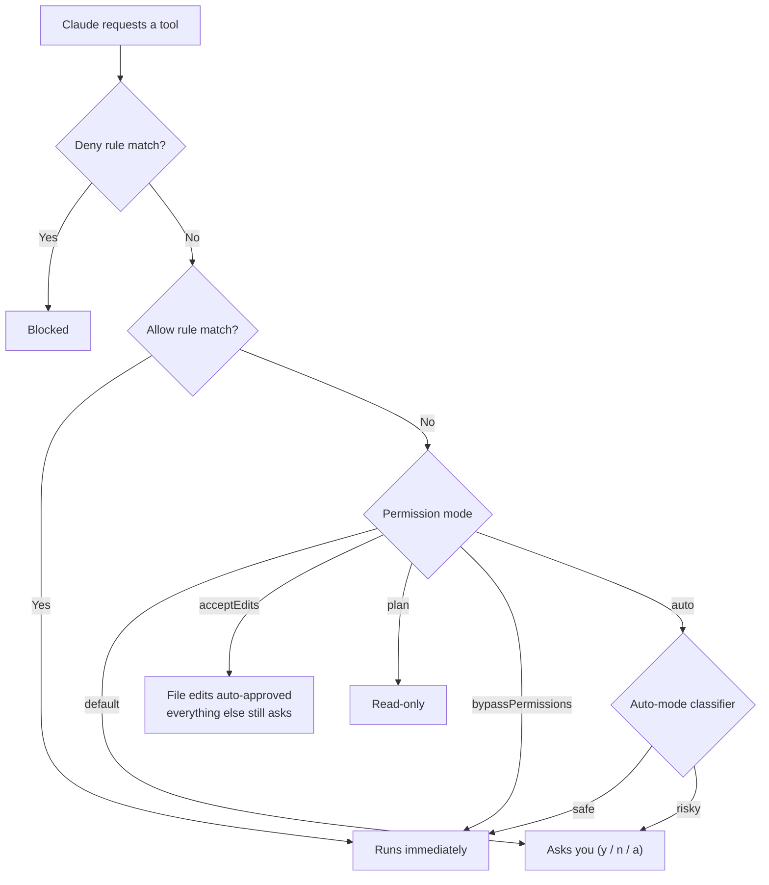

# Permission System

**Overview: how a tool call gets decided**



### Benefits and Use Cases

> **Why have permissions?**
>
> Claude Code can run shell commands, edit files, and delete data. The permission system prevents Claude from doing things you **didn't intend**. You can choose your level of autonomy — from "ask about everything" to "do anything".

**Use Cases by Role:**

| Role/Scenario | Recommended Mode | Reason |
|---------------|------------------|--------|
| **Beginner developer** | `default` | Asks before everything — you learn what Claude does |
| **General-purpose coding** | `acceptEdits` | Can read/edit files freely; only asks for risky shell commands. Smooth without approving every step |
| **Exploring a project before editing** | `plan` | Claude can only read and propose plans, no actual edits — perfect for understanding a codebase first |
| **Long-running tasks, hands-off** | `auto` | Claude decides on its own with automatic safety checks. Good for big tasks you'll review later |
| **CI/CD pipeline** | `dontAsk` | Locked to approved tools, no prompts mid-run — runs without anyone needing to approve |
| **Secure container/VM** | `bypassPermissions` | Anything goes — only use in environments isolated from production |
| **Working with customer data** | `default` + `deny` rules | Block dangerous commands like `rm -rf` or `curl` — prevents data leaks |

**Real-world examples:**

```
Scenario: You're fixing a bug in production code
Recommendation: Start with "plan" to analyze, then switch to "acceptEdits" when ready to fix
How: Press Shift+Tab to switch modes instantly

Scenario: Have Claude refactor 50 files
Recommendation: Use "auto" mode because there are many files; with default you'd hit Approve hundreds of times
How: claude --permission-mode auto

Scenario: Run Claude in GitHub Actions
Recommendation: Use "dontAsk" + allowedTools to limit it to safe commands
How: claude --permission-mode dontAsk --allowedTools "Read,Bash(npm test)"
```

### Permission Modes

| Mode | What runs without asking | Best for |
|------|--------------------------|----------|
| `default` | File reading only | Getting started, sensitive work |
| `acceptEdits` | Read + edit files + common FS commands | General coding |
| `plan` | Read only (planning mode) | Exploring before changing anything |
| `auto` | Everything + automatic safety checks | Long-running tasks (experimental) |
| `dontAsk` | Only pre-approved tools | CI/CD with locked permissions |
| `bypassPermissions` | Everything except protected paths | Use only in containers/VMs |

### Switching Modes

- Press `Shift+Tab` in interactive mode
- Use the `--permission-mode <mode>` flag
- Configure in `settings.json`

**Auto mode** has matured: it no longer requires an opt-in consent step. A new `autoMode.hard_deny` rule type lets you hard-block actions in `settings.json`. The auto-mode classifier is improved for catching data-exfiltration patterns.

### Permission Rules

**Match all uses of a tool:**
```
Bash             # All Bash commands
Read             # Read every file
Edit             # Edit every file
```

**Add additional conditions:**
```
Bash(npm run build)              # Specific command
Bash(npm run *)                  # Wildcard
Read(./.env)                     # Specific file
Read(src/**)                     # Every file in a directory
WebFetch(domain:github.com)      # Specific domain only
Agent(Explore)                   # Specific subagent
Skill(commit)                    # Specific skill
```

### New in v2.1.191

- **Parameter-matching rules** — `Tool(param:value)` matches a tool's input parameters (with `*` wildcard), e.g. `Agent(model:opus)` to block Opus subagents.
- **Glob in deny tool-name position** — `"*"` in a deny rule denies all tools; unknown tool names in deny rules warn at startup.
- **Cross-session messaging hardened** — messages relayed via `SendMessage` from other Claude sessions no longer carry user authority; receivers refuse relayed permission requests and Auto mode blocks them.
- **Auto mode safety** — Auto mode now blocks destructive git (`git reset --hard`, `git checkout -- .`, `git clean -fd`, `git stash drop`), `git commit --amend` of commits it didn't make this session, and `terraform/pulumi/cdk destroy` unless you asked for that stack. It's also available on Bedrock/Vertex/Foundry (opt in with `CLAUDE_CODE_ENABLE_AUTO_MODE=1`).

### New in v2.1.195
- **`autoMode.classifyAllShell`** — route *all* Bash/PowerShell commands through the Auto-mode classifier, not just arbitrary-code-execution patterns.
- **Auto-mode denial reasons** now appear in the transcript, the denial toast, and `/permissions` → recent denials.

### New in v2.1.201
- **The "default" permission mode is now labeled "Manual"** across the CLI, `--help`, VS Code, and JetBrains — `--permission-mode manual` and `"defaultMode": "manual"` are accepted alongside the old `default` value *(v2.1.200)*.
- `AskUserQuestion` dialogs no longer auto-continue by default — opt into an idle timeout via `/config` *(v2.1.200)*.

### New in v2.1.205
- A grey **⏸ badge** now shows in the footer while you're in **Manual** permission mode, so the active mode is always visible *(v2.1.203)*.
- **Auto mode hardening** — blocks tampering with session transcript files, and asks before running `rm -rf` on a variable it can't resolve from context.

### New in v2.1.207
- **Auto mode is now on by default on Bedrock, Vertex AI, and Foundry** — the `CLAUDE_CODE_ENABLE_AUTO_MODE` opt-in is no longer required; turn it off with the `disableAutoMode` setting.
- Auto mode configuration is no longer read from the repo-resident `.claude/settings.local.json` — put `autoMode` settings in `~/.claude/settings.json` instead.

### Rule Priority

1. **Deny** (highest) — always block
2. **Ask** — prompt before doing
3. **Allow** (lowest) — always allow

### Configure in settings.json

```json
{
  "permissions": {
    "defaultMode": "acceptEdits",
    "allow": ["Bash(npm run *)", "Bash(git *)"],
    "deny": ["Bash(rm -rf *)"],
    "ask": ["Bash"]
  }
}
```

### Protected Paths (always protected files/folders)

- `.git/`
- `.claude/` (except commands, agents, skills, worktrees)
- `.vscode/`, `.idea/`, `.husky/`
- `.gitconfig`, `.bashrc`, shell config files

⚠️ `--dangerously-skip-permissions` now also bypasses prompts for protected paths (`.claude/`, `.git/`, `.vscode/`, shell config files). Treat it as truly unrestricted.

---

---

## Navigation

- ⬅️ Previous: [[04-keyboard-shortcuts]]
- ➡️ Next: [[06-configuration]]
- 🏠 Index: [[README]]
- 🌐 Other language: [[../th/05-permissions]]
