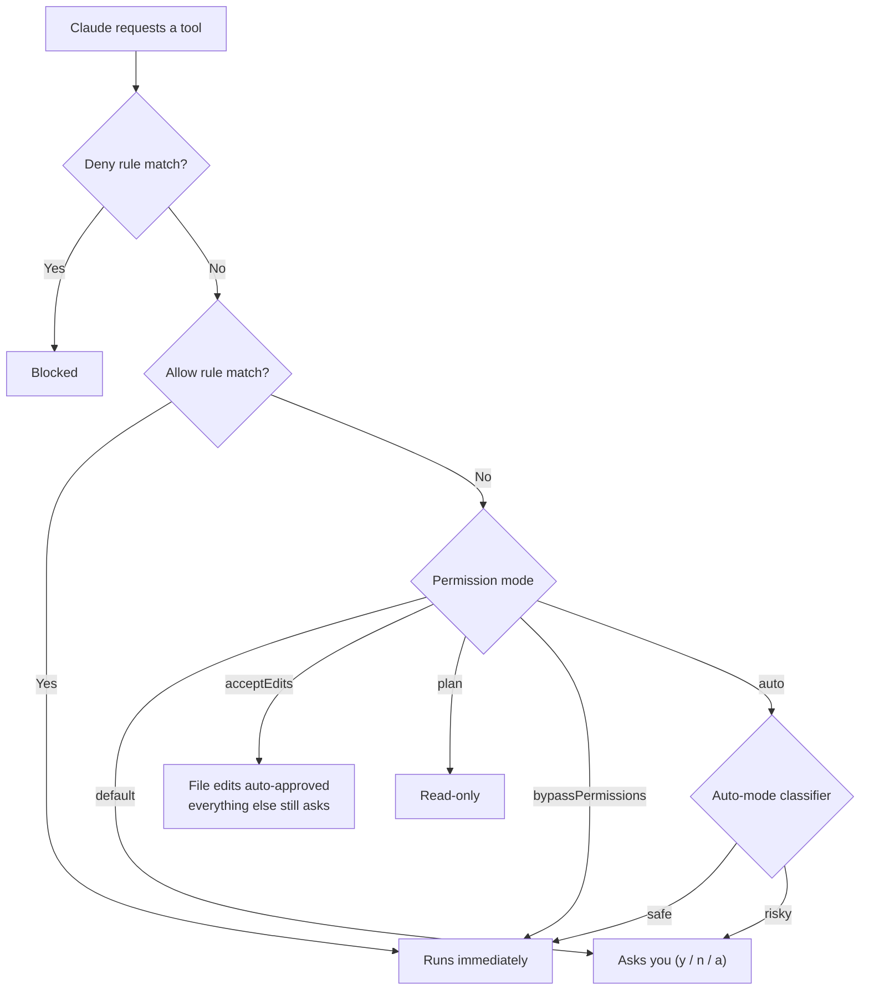

# Permission System

**Overview: how a tool call gets decided**


```mermaid
flowchart TD
    T["Claude requests a tool"] --> D{"Deny rule match?"}
    D -- "Yes" --> X["Blocked"]
    D -- "No" --> A{"Allow rule match?"}
    A -- "Yes" --> R["Runs immediately"]
    A -- "No" --> M{"Permission mode"}
    M -- "default" --> P["Asks you (y / n / a)"]
    M -- "acceptEdits" --> E["File edits auto-approved<br/>everything else still asks"]
    M -- "plan" --> PL["Read-only"]
    M -- "bypassPermissions" --> R
    M -- "auto" --> C{"Auto-mode classifier"}
    C -- "safe" --> R
    C -- "risky" --> P
```

### Benefits and Use Cases

> **Why have permissions?**
>
> Claude Code can run shell commands, edit files, and delete data. The permission system prevents Claude from doing things you **didn't intend**. You can choose your level of autonomy — from "ask about everything" to "do anything".

**Use Cases by Role:**

| Role/Scenario | Recommended Mode | Reason |
|---------------|------------------|--------|
| **Beginner developer** | `default` | Asks before everything — you learn what Claude does |
| **General-purpose coding** | `acceptEdits` | Can read/edit files freely; only asks for risky shell commands. Smooth without approving every step |
| **Exploring a project before editing** | `plan` | Claude can only read and propose plans, no actual edits — perfect for understanding a codebase first |
| **Long-running tasks, hands-off** | `auto` | Claude decides on its own with automatic safety checks. Good for big tasks you'll review later |
| **CI/CD pipeline** | `dontAsk` | Locked to approved tools, no prompts mid-run — runs without anyone needing to approve |
| **Secure container/VM** | `bypassPermissions` | Anything goes — only use in environments isolated from production |
| **Working with customer data** | `default` + `deny` rules | Block dangerous commands like `rm -rf` or `curl` — prevents data leaks |

**Real-world examples:**

```
Scenario: You're fixing a bug in production code
Recommendation: Start with "plan" to analyze, then switch to "acceptEdits" when ready to fix
How: Press Shift+Tab to switch modes instantly

Scenario: Have Claude refactor 50 files
Recommendation: Use "auto" mode because there are many files; with default you'd hit Approve hundreds of times
How: claude --permission-mode auto

Scenario: Run Claude in GitHub Actions
Recommendation: Use "dontAsk" + allowedTools to limit it to safe commands
How: claude --permission-mode dontAsk --allowedTools "Read,Bash(npm test)"
```

### Permission Modes

| Mode | What runs without asking | Best for |
|------|--------------------------|----------|
| `default` | File reading only | Getting started, sensitive work |
| `acceptEdits` | Read + edit files + common FS commands | General coding |
| `plan` | Read only (planning mode) | Exploring before changing anything |
| `auto` | Everything + automatic safety checks | Long-running tasks (experimental) |
| `dontAsk` | Only pre-approved tools | CI/CD with locked permissions |
| `bypassPermissions` | Everything except protected paths | Use only in containers/VMs |

### Switching Modes

- Press `Shift+Tab` in interactive mode
- Use the `--permission-mode <mode>` flag
- Configure in `settings.json`

**Auto mode** has matured: it no longer requires an opt-in consent step. A new `autoMode.hard_deny` rule type lets you hard-block actions in `settings.json`. The auto-mode classifier is improved for catching data-exfiltration patterns.

### Permission Rules

**Match all uses of a tool:**
```
Bash             # All Bash commands
Read             # Read every file
Edit             # Edit every file
```

**Add additional conditions:**
```
Bash(npm run build)              # Specific command
Bash(npm run *)                  # Wildcard
Read(./.env)                     # Specific file
Read(src/**)                     # Every file in a directory
WebFetch(domain:github.com)      # Specific domain only
Agent(Explore)                   # Specific subagent
Skill(commit)                    # Specific skill
```

### New in v2.1.191

- **Parameter-matching rules** — `Tool(param:value)` matches a tool's input parameters (with `*` wildcard), e.g. `Agent(model:opus)` to block Opus subagents.
- **Glob in deny tool-name position** — `"*"` in a deny rule denies all tools; unknown tool names in deny rules warn at startup.
- **Cross-session messaging hardened** — messages relayed via `SendMessage` from other Claude sessions no longer carry user authority; receivers refuse relayed permission requests and Auto mode blocks them.
- **Auto mode safety** — Auto mode now blocks destructive git (`git reset --hard`, `git checkout -- .`, `git clean -fd`, `git stash drop`), `git commit --amend` of commits it didn't make this session, and `terraform/pulumi/cdk destroy` unless you asked for that stack. It's also available on Bedrock/Vertex/Foundry (opt in with `CLAUDE_CODE_ENABLE_AUTO_MODE=1`).

### New in v2.1.195
- **`autoMode.classifyAllShell`** — route *all* Bash/PowerShell commands through the Auto-mode classifier, not just arbitrary-code-execution patterns.
- **Auto-mode denial reasons** now appear in the transcript, the denial toast, and `/permissions` → recent denials.

### New in v2.1.201
- **The "default" permission mode is now labeled "Manual"** across the CLI, `--help`, VS Code, and JetBrains — `--permission-mode manual` and `"defaultMode": "manual"` are accepted alongside the old `default` value *(v2.1.200)*.
- `AskUserQuestion` dialogs no longer auto-continue by default — opt into an idle timeout via `/config` *(v2.1.200)*.

### New in v2.1.205
- A grey **⏸ badge** now shows in the footer while you're in **Manual** permission mode, so the active mode is always visible *(v2.1.203)*.
- **Auto mode hardening** — blocks tampering with session transcript files, and asks before running `rm -rf` on a variable it can't resolve from context.

### New in v2.1.207
- **Auto mode is now on by default on Bedrock, Vertex AI, and Foundry** — the `CLAUDE_CODE_ENABLE_AUTO_MODE` opt-in is no longer required; turn it off with the `disableAutoMode` setting.
- Auto mode configuration is no longer read from the repo-resident `.claude/settings.local.json` — put `autoMode` settings in `~/.claude/settings.json` instead.

### New in v2.1.208
- **Hidden catastrophic removals now always prompt** — commands that wrap a catastrophic removal (e.g. `rm -rf ~`) in `$(…)`, backticks, or `<(…)` now ask for confirmation even in `--dangerously-skip-permissions` and Auto mode, matching the plain form.

### New in v2.1.210
- **Startup warning for misnamed permission rules** — `Write(path)`, `NotebookEdit(path)`, and `Glob(path)` rules now trigger a warning at startup; use `Edit(path)` or `Read(path)` instead.
- **Auto mode classifier defaults to Sonnet 5** — for external sessions the permission classifier now defaults to Sonnet 5, validated on the session's first request and pinned for the rest of the session.

### New in v2.1.211
- **"Always allow" rules now save at the repository root** — approvals granted inside a git worktree persist across sessions and other worktrees of the same repo.

### New in v2.1.214
- **`docker` daemon-redirect flags now prompt** — `docker` commands (including the Podman `docker` shim) carrying `--url`, `--connection`, `--identity`, or Podman's remote mode now require permission instead of running without one.
- **`file` magic/list flags need permission** — `file` commands using `-m`/`--magic-file` or `-f`/`--files-from` now require permission instead of being auto-allowed as read-only.

### New in v2.1.218
- **Auto mode opens fewer dialogs** — the dangerous-rm, background-`&`, and suspicious-Windows-path checks no longer open permission dialogs; the auto-mode classifier adjudicates them instead.
- **Plan mode with auto prompts less** — Bash commands the static analyzer can't prove read-only no longer trigger a prompt; the auto-mode classifier judges them instead.

### New in v2.1.221
- **Hidden zsh commands now prompt** — commands smuggled inside `[[ ]]` regex conditionals used to slip past the Bash permission check; they go through permission prompts now.
- **Quoted Windows paths now prompt** — PowerShell permission checks mishandled paths containing quote characters; such paths now ask for approval.
- **Sandboxed credential files can be masked** — the new `mode: "mask"` on `sandbox.credentials` lets a sandboxed command read a sentinel copy while the real value is substituted on egress (Linux/WSL; macOS falls back to `deny`). See [[06-configuration]].
- **Auto mode is cheaper and more predictable** — permission checks for parallel tool calls reuse the cached conversation prefix, and switching permission mode while a check is pending now prompts reliably instead of applying the stale result.

### New in v2.1.222
- **Auto mode screens agent-to-agent messages** — messages sent to other agent sessions via `SendMessage` now pass through the permission classifier before dispatch.

### New in v2.1.224
- **Sandbox violations are visible in Bash results** — a denied command now reports which file or network access the sandbox blocked and why, instead of the details never reaching the tool result.
- **Credential masking gained structured options** — `sandbox.credentials` masking now handles structured env values, JWT claims, and AWS SigV4 re-signing; the new options require `network.tlsTerminate` and are honored only from user settings, managed settings, or `--settings`. See [[06-configuration]].

### New in v2.1.228
- **Write no longer forces a read first on newer models** — the `Write` tool lets newer models overwrite an existing file they haven't read in the session, matching the `Edit` tool's rules; older models still have to read the file first.

### New in v2.1.229
- **Sandbox network domain lists are stricter** — IPv6 literals must be bracketed (`[::1]:443`), and ambiguous spellings are enforced fail-closed and flagged by `/doctor`.

### New in v2.1.232
- **GitLab secrets are redacted** — the `glrt-`, `gloas-`, `glptt-`, `glagent-`, `glimt-`, `glsoat-`, `glcbt-`, `glft-` and `glffct-` token families are redacted, and routable `glpat-` / `gldt-` tokens are redacted in full.
- **`glab` is protected like `gh`** — the GitLab CLI's config store now gets the same sandbox and credential-path protection as the GitHub CLI's.
- **Server-managed sandbox binary overrides need approval** — `sandbox.bwrapPath`, `sandbox.socatPath` and `sandbox.ripgrep` delivered through managed settings now require your approval instead of applying silently.

### New in v2.1.235
- **Permission dialogs match what a grant actually covers** — the display text and the "don't ask again" option now always describe exactly what approving would allow, and "don't ask again" is withheld when the contents can't be fully displayed.

### New in v2.1.236
- **Wildcard read-deny rules win inside allowed regions (macOS sandbox)** — a rule like `**/.env` now takes precedence inside a region the sandbox is allowed to read, covers the contents of any directory it matches, and can't be bypassed by renaming the denied file.
- **Auto mode reviews `Monitor` like Bash** — `Monitor` allow rules are set aside while auto mode is active, so Monitor commands go through the same review as Bash commands.
- **Auto mode's classifier behaves the same off the Claude API** — on Bedrock, Vertex AI and Foundry, and when telemetry is disabled, it now uses the Claude API defaults, including severity-scored classification.
- **Auto mode's git status check can't be fooled** — a repo setting `status.showUntrackedFiles=no` no longer makes it report a clean tree.

### New in v2.1.243
- **The sandboxed Bash prompt no longer lists allowed network hosts** — Claude now attempts requests (and you can approve new hosts) instead of assuming unlisted hosts are blocked.

### Rule Priority

1. **Deny** (highest) — always block
2. **Ask** — prompt before doing
3. **Allow** (lowest) — always allow

### Configure in settings.json

```json
{
  "permissions": {
    "defaultMode": "acceptEdits",
    "allow": ["Bash(npm run *)", "Bash(git *)"],
    "deny": ["Bash(rm -rf *)"],
    "ask": ["Bash"]
  }
}
```

### Protected Paths (always protected files/folders)

- `.git/`
- `.claude/` (except commands, agents, skills, worktrees)
- `.vscode/`, `.idea/`, `.husky/`
- `.gitconfig`, `.bashrc`, shell config files

⚠️ `--dangerously-skip-permissions` now also bypasses prompts for protected paths (`.claude/`, `.git/`, `.vscode/`, shell config files). Treat it as truly unrestricted.

---

---

## Navigation

- ⬅️ Previous: [[04-keyboard-shortcuts]]
- ➡️ Next: [[06-configuration]]
- 🏠 Index: [[README]]
- 🌐 Other language: [[../th/05-permissions]]
