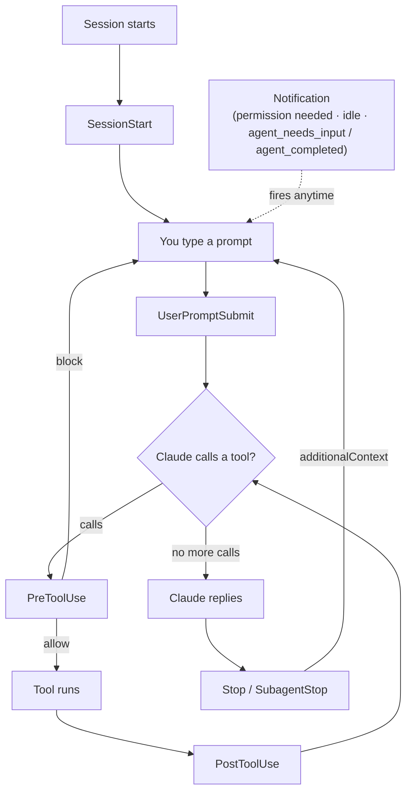

# Hooks (Event Handler System)

**Overview: where hooks fire in a turn**



### Benefits and Use Cases

> **Why use hooks?**
>
> Hooks let you **build automated workflows** that run whenever Claude does certain things — no need to repeat "remember to run lint after editing" because the hook does it for you.

**Use Cases:**

| Hook | Use Case | Real-World Example |
|------|----------|--------------------|
| **PostEdit + Prettier** | Auto-format after editing | Every time Claude edits a `.ts` file, Prettier formats it automatically — code is always clean |
| **PostEdit + ESLint** | Auto-lint after editing | Every time Claude edits a file, ESLint checks it; if there are errors, Claude sees them immediately and fixes |
| **PostWrite + Test runner** | Auto-test after creating files | Every time Claude creates a new file, tests run automatically; if they fail, Claude fixes them |
| **PreCommit + Lint** | Check before committing | Prevents commits with lint errors from going into Git |
| **PostCommit + Slack** | Notify after commit | Sends a notification to Slack each time Claude commits |
| **Init + Setup** | Set up when starting a session | Run `docker-compose up`, check dependencies, configure environment |
| **PreToolUse + Custom logic** | Custom permission checks | Block Claude from accessing certain file types or running specific commands |
| **TaskCompleted + Verify** | Verify the result | When Claude finishes a task, run the test suite to confirm nothing broke |

**Real-world example:**

```
Without hooks:
  Claude edits file → code isn't formatted → you say "run Prettier too"
  Claude edits another file → forgets to format again → you repeat
  → Wastes time repeating yourself

With a PostEdit hook:
  Claude edits file → Prettier runs automatically → properly formatted
  Claude edits another file → Prettier runs automatically → properly formatted
  → No repetition; every file is formatted automatically
```

### What are Hooks?

Event handlers that run shell commands automatically when events happen in Claude Code.

### Available Hooks

| Hook | When | Used For |
|------|------|----------|
| `Init` | Session starts | Initial setup |
| `Maintenance` | Maintenance mode | Clean up temp files |
| `PreToolUse` | Before using a tool | Custom permission checks |
| `PostToolUse` | After using a tool | Auto-format, validate |
| `MessageDisplay` | Before a message is displayed | Transform messages before display |
| `PostWrite` | After writing a file | Lint, format |
| `PostEdit` | After editing a file | Auto-test |
| `PreCommit` | Before a Git commit | Pre-commit checks |
| `PostCommit` | After a Git commit | Notifications |
| `PermissionRequest` | When permission is requested | Auto-approve |
| `PermissionDenied` | When permission is denied | Logging |
| `TaskCreated` | A task is created | Inspect the task |
| `TaskCompleted` | A task is completed | Verify the result |
| `TeammateIdle` | A teammate is idle | Quality gates |

### Configuring Hooks

**In `.claude/settings.json`:**

```json
{
  "hooks": {
    "PostWrite": [
      {
        "matcher": "Edit(src/**/*.ts)",
        "hooks": [
          {
            "type": "command",
            "command": "npx prettier --write $FILE"
          }
        ]
      }
    ],
    "PostEdit": [
      {
        "matcher": "Edit(src/**/*.py)",
        "hooks": [
          {
            "type": "command",
            "command": "black $FILE"
          }
        ]
      }
    ],
    "PreCommit": [
      {
        "hooks": [
          {
            "type": "command",
            "command": "npm run lint"
          }
        ]
      }
    ]
  }
}
```

### Example: Auto-Format TypeScript After Editing

```json
{
  "hooks": {
    "PostEdit": [
      {
        "matcher": "Edit(src/**/*.{ts,tsx})",
        "hooks": [
          {
            "type": "command",
            "command": "npx prettier --write $FILE && npx eslint --fix $FILE"
          }
        ]
      }
    ]
  }
}
```

### New Hook Capabilities

- **`MessageDisplay` hook event** — transform messages before they're displayed.
- **`SessionStart` hooks** can return `reloadSkills: true` and set the session title via `hookSpecificOutput.sessionTitle`.
- **`PostToolUse` / `PostToolUseFailure` inputs** now include `duration_ms` (tool execution time).
- **`PostToolUse`** can replace tool output via `hookSpecificOutput.updatedToolOutput`.
- **Exec form** — hooks support `args: string[]` (run without a shell). Hooks also receive the effort level (`$CLAUDE_EFFORT` / JSON).
- `Stop` and `SubagentStop` hooks can return `hookSpecificOutput.additionalContext` to give Claude feedback and keep the turn going (not flagged as a hook error).
- Self-hosted runner: a `post-session` lifecycle hook runs after the session ends and before the workspace is deleted (snapshot uncommitted work, export logs).
- Matchers can be **comma-separated**, e.g. `"Bash,PowerShell"`.
- Hook `if` conditions can match tool paths — `Edit(src/**)`, `Read(~/.ssh/**)`, `Read(.env)` now match correctly.

### New in v2.1.195
- **Hook matchers exact-match hyphenated identifiers** — names like `code-reviewer` or `mcp__brave-search` no longer substring-match. To match all tools from a hyphenated MCP server, use a pattern like `mcp__brave-search__.*`.

> Skills & slash commands can set `disallowed-tools` in their frontmatter.

### New in v2.1.198

- The **`Notification`** hook now fires for background agents: `agent_needs_input` (a session is waiting on you) and `agent_completed` (a session finished).

---

---

## Navigation

- ⬅️ Previous: [[09-mcp-servers]]
- ➡️ Next: [[11-skills]]
- 🏠 Index: [[README]]
- 🌐 Other language: [[../th/10-hooks]]
