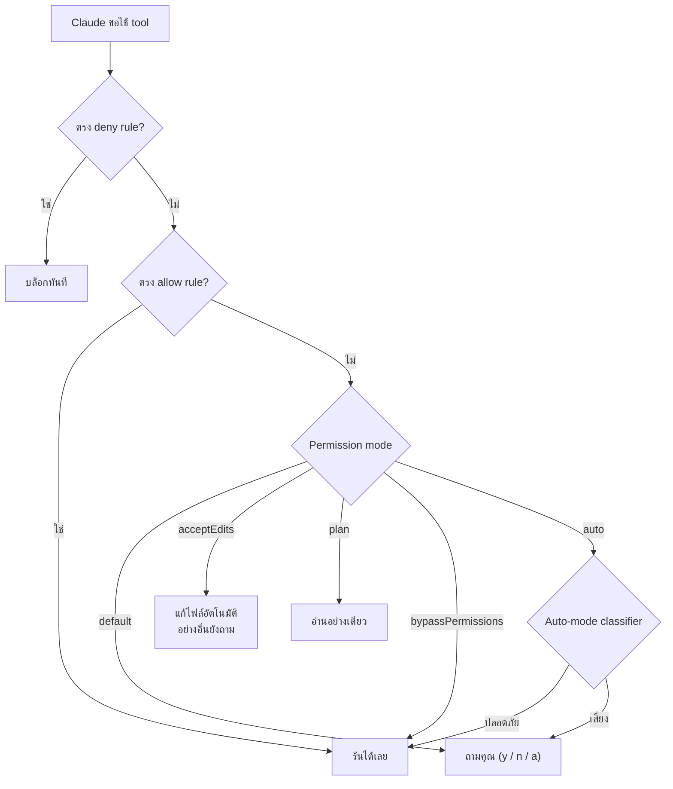

# ระบบ Permission (สิทธิ์การเข้าถึง)

**ภาพรวม: คำสั่งหนึ่ง ๆ ถูกตัดสินยังไง**



### ประโยชน์และ Use Cases

> **ทำไมต้องมี Permission?**
>
> Claude Code สามารถรันคำสั่ง Shell, แก้ไขไฟล์, ลบข้อมูล — ระบบ Permission ป้องกันไม่ให้ Claude ทำสิ่งที่คุณ **ไม่ได้ตั้งใจให้ทำ** คุณเลือกระดับความอิสระได้ตั้งแต่ "ถามทุกอย่าง" ไปจนถึง "ทำได้เลยทุกอย่าง"

**Use Cases ตามบทบาท:**

| บทบาท/สถานการณ์ | โหมดที่แนะนำ | เหตุผล |
|----------------|------------|--------|
| **นักพัฒนามือใหม่** | `default` | ถามทุกอย่างก่อนทำ ได้เรียนรู้ว่า Claude ทำอะไร |
| **เขียนโค้ดทั่วไป** | `acceptEdits` | อ่าน/แก้ไขไฟล์ได้เลย ถามเฉพาะคำสั่ง Shell ที่อาจเสี่ยง ทำงานได้ลื่นโดยไม่ต้องกด Approve ทุกขั้นตอน |
| **สำรวจโปรเจกต์ก่อนแก้ไข** | `plan` | Claude อ่านได้อย่างเดียว เสนอแผนแต่ไม่แก้ไขจริง เหมาะกับการทำความเข้าใจ Codebase ก่อนลงมือ |
| **งานระยะยาว ปล่อยให้ทำเอง** | `auto` | Claude ตัดสินใจเอง มี Safety Check อัตโนมัติ เหมาะเวลาให้ Claude ทำงานใหญ่ ๆ แล้วกลับมาดูผลทีหลัง |
| **CI/CD Pipeline** | `dontAsk` | ล็อกเฉพาะเครื่องมือที่อนุมัติ ไม่มี Prompt ระหว่างทาง รันได้โดยไม่ต้องมีคนกดอนุญาต |
| **Container/VM ที่ปลอดภัย** | `bypassPermissions` | ทำได้ทุกอย่าง ใช้เฉพาะสภาพแวดล้อมที่แยกจาก Production |
| **ทำงานกับข้อมูลลูกค้า** | `default` + `deny` rules | บล็อกคำสั่งอันตราย เช่น `rm -rf`, `curl` ป้องกันข้อมูลรั่วไหล |

**ตัวอย่างสถานการณ์จริง:**

```
สถานการณ์: คุณกำลังแก้ Bug ใน Production Code
แนะนำ: เริ่มด้วย "plan" เพื่อวิเคราะห์ → สลับเป็น "acceptEdits" เมื่อพร้อมแก้ไข
วิธี: กด Shift+Tab เพื่อสลับโหมดได้ทันที

สถานการณ์: ให้ Claude รีแฟคเตอร์โค้ด 50 ไฟล์
แนะนำ: ใช้ "auto" mode เพราะต้องแก้ไฟล์เยอะ ถ้าใช้ default จะต้องกด Approve หลายร้อยครั้ง
วิธี: claude --permission-mode auto

สถานการณ์: รัน Claude ใน GitHub Actions
แนะนำ: ใช้ "dontAsk" + allowedTools เพื่อล็อกเฉพาะคำสั่งที่ปลอดภัย
วิธี: claude --permission-mode dontAsk --allowedTools "Read,Bash(npm test)"
```

### โหมด Permission

| โหมด | สิ่งที่รันได้โดยไม่ต้องถาม | เหมาะสำหรับ |
|------|--------------------------|------------|
| `default` | อ่านไฟล์เท่านั้น | เริ่มต้นใช้งาน, งานที่ต้องระวัง |
| `acceptEdits` | อ่าน + แก้ไขไฟล์ + คำสั่ง FS ทั่วไป | เขียนโค้ดทั่วไป |
| `plan` | อ่านเท่านั้น (โหมดวางแผน) | สำรวจก่อนลงมือทำ |
| `auto` | ทุกอย่าง + ตรวจสอบความปลอดภัยอัตโนมัติ | งานระยะยาว (ทดลอง) |
| `dontAsk` | เฉพาะเครื่องมือที่อนุมัติล่วงหน้า | CI/CD ที่ล็อกสิทธิ์ |
| `bypassPermissions` | ทุกอย่างยกเว้น Protected Paths | ใช้ใน Container/VM เท่านั้น |

### วิธีสลับโหมด

- กด `Shift+Tab` ใน Interactive Mode
- ใช้ Flag `--permission-mode <mode>`
- ตั้งค่าใน `settings.json`

**Auto mode** โตเต็มวัยแล้ว: ไม่ต้องกด opt-in ก่อนใช้ และเพิ่ม rule แบบ `autoMode.hard_deny` ใน `settings.json` เพื่อ hard-block การกระทำได้; classifier ตรวจจับรูปแบบ data exfiltration ได้ดีขึ้น

### กฎ Permission

**จับคู่เครื่องมือทั้งหมด:**
```
Bash             # Bash ทุกคำสั่ง
Read             # อ่านไฟล์ทุกอัน
Edit             # แก้ไฟล์ทุกอัน
```

**ระบุเงื่อนไขเพิ่ม:**
```
Bash(npm run build)              # คำสั่งเฉพาะ
Bash(npm run *)                  # Wildcard
Read(./.env)                     # ไฟล์เฉพาะ
Read(src/**)                     # ทุกไฟล์ในไดเรกทอรี
WebFetch(domain:github.com)      # เฉพาะโดเมน
Agent(Explore)                   # Subagent เฉพาะ
Skill(commit)                    # Skill เฉพาะ
```

### ลำดับความสำคัญของกฎ

1. **Deny** (สูงสุด) - บล็อกเสมอ
2. **Ask** - ถามก่อนทำ
3. **Allow** (ต่ำสุด) - อนุญาตเสมอ

### ตั้งค่าใน settings.json

```json
{
  "permissions": {
    "defaultMode": "acceptEdits",
    "allow": ["Bash(npm run *)", "Bash(git *)"],
    "deny": ["Bash(rm -rf *)"],
    "ask": ["Bash"]
  }
}
```

### Protected Paths (ไฟล์/โฟลเดอร์ที่ป้องกันเสมอ)

- `.git/`
- `.claude/` (ยกเว้น commands, agents, skills, worktrees)
- `.vscode/`, `.idea/`, `.husky/`
- `.gitconfig`, `.bashrc`, ไฟล์ Shell Config

⚠️ `--dangerously-skip-permissions` ตอนนี้ข้าม prompt ของ protected paths (`.claude/`, `.git/`, `.vscode/`, ไฟล์ตั้งค่า shell) ด้วย — ถือว่า 'ไม่จำกัดจริงๆ'

### 🆕 ใหม่ใน v2.1.191

- **กฎจับ parameter** — `Tool(param:value)` จับค่า parameter ของ tool ได้ (ใช้ `*` wildcard) เช่น `Agent(model:opus)` เพื่อบล็อก subagent ที่ใช้ Opus
- **Glob ในตำแหน่งชื่อ tool ของ deny** — `"*"` ใน deny rule = บล็อกทุก tool; ชื่อ tool ที่ไม่รู้จักใน deny rule จะเตือนตอน startup
- **เสริมความปลอดภัย cross-session messaging** — ข้อความที่ relay มาผ่าน `SendMessage` จาก session อื่นไม่มี user authority แล้ว; ผู้รับจะปฏิเสธ permission ที่ relay มา และ Auto mode บล็อกให้
- **ความปลอดภัย Auto mode** — Auto mode บล็อกคำสั่ง git อันตราย (`git reset --hard`, `git checkout -- .`, `git clean -fd`, `git stash drop`), `git commit --amend` ของ commit ที่ไม่ได้ทำเองใน session นี้ และ `terraform/pulumi/cdk destroy` เว้นแต่สั่งเอง; ใช้บน Bedrock/Vertex/Foundry ได้ (opt-in `CLAUDE_CODE_ENABLE_AUTO_MODE=1`)

### 🆕 ใหม่ใน v2.1.195

- **`autoMode.classifyAllShell`** — ส่งคำสั่ง Bash/PowerShell *ทุกคำสั่ง* ผ่าน Auto-mode classifier (ไม่ใช่แค่ pattern ที่รันโค้ดอิสระ)
- **เหตุผลที่ Auto mode ปฏิเสธ** แสดงใน transcript, toast ตอน deny, และ `/permissions` → รายการ deny ล่าสุด แล้ว

### 🆕 ใหม่ใน v2.1.201
- **โหมด permission "default" เปลี่ยนป้ายเป็น "Manual"** ทั้งใน CLI, `--help`, VS Code, JetBrains — ใช้ได้ทั้ง `--permission-mode manual` และค่า `default` เดิม (`"defaultMode": "manual"` ก็ได้) *(v2.1.200)*
- กล่อง `AskUserQuestion` ไม่ auto-continue เองแล้ว — เปิด idle timeout ได้ผ่าน `/config` *(v2.1.200)*

### 🆕 ใหม่ใน v2.1.205
- มี **badge ⏸ สีเทา** ที่ footer ตอนอยู่โหมด **Manual** — เห็นตลอดว่ากำลังใช้โหมดไหน *(v2.1.203)*
- **Auto mode เข้มขึ้น** — บล็อกการแก้ไฟล์ transcript ของ session และถามก่อนรัน `rm -rf` กับตัวแปรที่เดาค่าไม่ได้จาก context

### 🆕 ใหม่ใน v2.1.207
- **Auto mode เปิดใช้บน Bedrock, Vertex AI, Foundry ได้เลยโดยไม่ต้อง opt-in** — ไม่ต้องตั้ง `CLAUDE_CODE_ENABLE_AUTO_MODE` แล้ว; ถ้าอยากปิดใช้ setting `disableAutoMode`
- ค่า `autoMode` ไม่ถูกอ่านจาก `.claude/settings.local.json` ในตัว repo อีกต่อไป — ให้ตั้งใน `~/.claude/settings.json` แทน

---

---

## Navigation

- ⬅️ Previous: [[04-keyboard-shortcuts]]
- ➡️ Next: [[06-configuration]]
- 🏠 Index: [[README]]
- 🌐 Other language: [[../en/05-permissions]]
